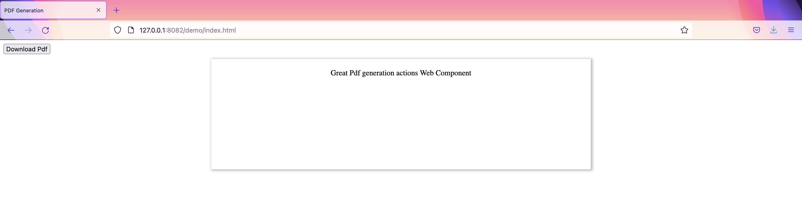

# PDF creation actions Web Component

[](https://github.com/TIGNUM/pdf-generation-actions-web-component/actions/workflows/release-package.yml) [](https://github.com/semantic-release/semantic-release)

Packages are released [on the public npm registry](https://www.npmjs.com/package/pdf-creation-actions-web-component).

Generate and download multi-page PDF from HTML passed as string to the Web Component.



## Install the component

```
>  npm i pdf-creation-actions-web-component
```

## Import the component

```
import 'pdf-creation-actions-web-component';
```

## Example (also look at the demo folder)

```
<print-to-pdf html="<div class="pages-wrapper"><div class="page-1"><style>p {color: red}</style}<p>first page to preview and print</p></div></div>" style="{root style as  string}"></print-to-pdf>
```

## Events

### "download-pdf"

The web component listens to a 'download-pdf' event to generate the PDF
from the HTML and start a download. You can pass on the attributes the
name of the file and the quality of the generated pdf as options (1-4).

For example if you fire the event from a button like this:

```
<button id="print-pdf" onclick="downloadPdf('filename-requested')">Download Pdf</button>
```

That function should emit a custom event as follows:

```
function downloadPdf(filename = 'no-file-name-provided') {
  const event = new CustomEvent("download-pdf", {
    composed: true,
    bubbles: true,
    detail: {
      fileName: filename,
      quality: 2, // to define scale, by default is 4
      orientation: 'landscape', //by default is 'portrait'
      unit: 'cm', // by default is 'in'
      format: 'A4', // by default is 'letter'
    },
  });
  document.getElementById('pdfComponent').shadowRoot.dispatchEvent(event);
}
```

### 'progress'

The web component emits 'progress' events with messages indicating the
current state of the pdf generation job.

```
window.addEventListener('progress', function(event) {
    console.log(event.detail.message);
  })
}
```

#### 'How to use it:'

1- Add to the tag the event 'progress':

```
<print-to-pdf ... @progress="onProgress" />
```

2- In the function that you declare "onProgress" capture the event message and then use it as you need it:

```
function onProgress(event) {
  const { detail: { message } } = event;
  console.log(message);
}

```

## Apply styles to the Web Component

This component has some styles that can be editable, and are defined in index.js in [static styles](https://github.com/TIGNUM/pdf-generation-actions-web-component/blob/main/index.js).
Example: By default the color and background are configured like:

    :host {
      color: var(--content-text-color, black);
      background: var(--content-background-color, white);
    }

The color and background can be modify by change this variables --content-text-color and ==content-background-color in print-to-pdf tag:

```
<style>
  print-to-pdf {
    --content-text-color: white;
    --content-background-color: #0000ff;
}
</style>
```

It is also possible to add css classes:

```
<print-to-pdf class="my-blue-element" html="<p>Test 1</p>" fileName="pdf-generated-1"></print-to-pdf>
<print-to-pdf class="my-red-element" html="<p>Test 2</p>" fileName="pdf-generated-2"></print-to-pdf>

<style>
  print-to-pdf.my-blue-element {
    --content-text-color: black;
  }
  print-to-pdf.my-red-element {
    --content-text-color: red;
  }
}
</style>
```

## Build

```
>    npm run build
```

## Run Tests

```
>    npm run test
```

## Demo on browser

```
>    npm run demo:web
```

and open:

    [http://127.0.0.1:8082/index.html](http://127.0.0.1:8082/index.html)
